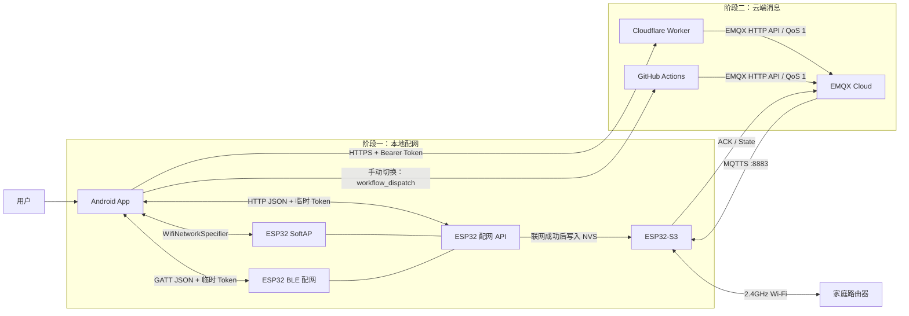
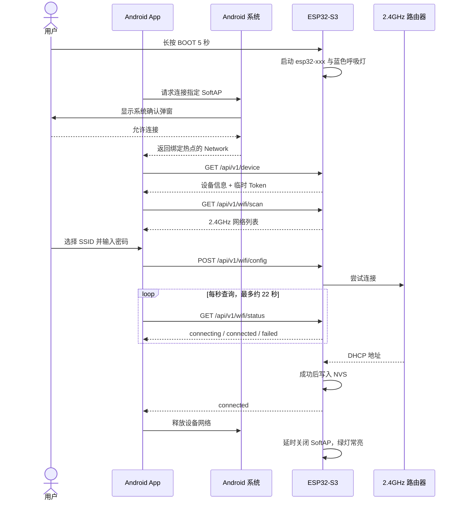
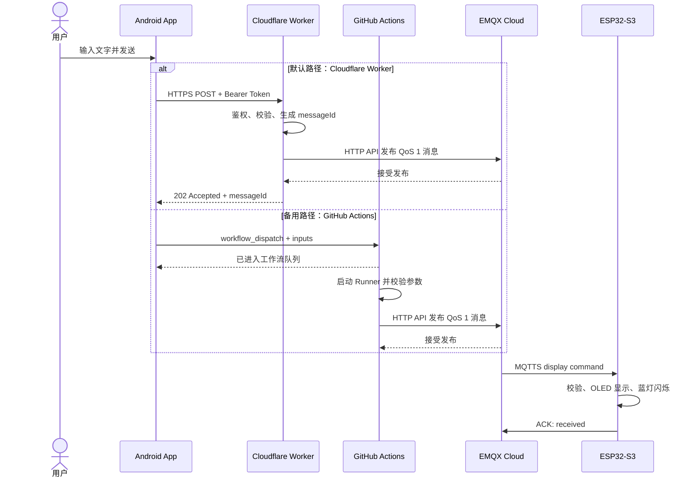

# ESP32-S3：从手机配网到云端 MQTT 消息下发

当前版本：固件 **0.6.2**、Android App **0.4.2**。长按 BOOT 5 秒后，App 可选择蓝牙或热点配网；蓝牙方式无需切换手机 Wi-Fi。0.6.1 修复首次蓝牙响应误超时断连，0.6.2 在选择热点配网后暂停蓝牙，处理热点扫描阶段断连问题。协议详见 [蓝牙配网](docs/BLE_PROVISIONING.md)，最新真机结果见本文“测试”。

> 一个覆盖嵌入式固件、Android App、Cloudflare Worker、GitHub Actions 和 EMQX Cloud
> 的端到端 IoT 原型。


这个项目解决两个看似简单、实际横跨多个系统的问题：

1. 一块刚上电、尚未连接互联网的 ESP32-S3，如何安全、可恢复地拿到家庭 Wi-Fi 配置？
2. 设备联网后，手机如何不再依赖局域网，经过云端向指定设备发送消息？

项目目前已经跑通完整链路：Android 手机通过 BLE 或 ESP32 临时热点，将 2.4GHz Wi-Fi
凭据交给设备；设备验证联网成功后才持久化配置，随后通过 TLS 连接 EMQX。手机还可以
默认调用 Cloudflare Worker，也可以手动切换到 GitHub Actions 备用路径。两条路径最终都
通过 EMQX 将显示命令发布到 MQTT；ESP32 收到后在 OLED 显示，并通过串口、RGB 指示灯
和 ACK 主题反馈结果。

当前使用的开发板是 `YD-ESP32-23 / ESP32-S3-N16R8`，已接入 128×64 I²C SSD1306
OLED 和高电平触发有源蜂鸣器。固件支持常用中英文自动换行显示，新消息到达时会发出
两声短促提示音。

## 项目能力

- 长按 BOOT 5 秒同时开启 BLE 和 SoftAP 配网入口，短按可退出配网模式。
- Android 可选择蓝牙配网，通过 GATT 传递设备信息、Wi-Fi 扫描结果、配置和状态，无需切换手机 Wi-Fi。
- 手机选择热点配网后暂停 BLE，退出并重新进入配网模式后恢复蓝牙入口。
- Android 10 及以上通过系统 Wi-Fi 弹窗连接 `esp32-xxx` 临时热点。
- ESP32 提供本地 HTTP JSON API，负责设备信息、Wi-Fi 扫描、配置和状态查询。
- 每次启动配网模式都会生成随机 `X-Provisioning-Token`，保护修改类接口。
- 新 Wi-Fi 凭据只有在设备成功联网并取得 IP 后才会写入 NVS。
- 已保存凭据不会因一次切换失败或退出配网而被覆盖。
- ESP32 使用 TLS 8883 端口连接 EMQX，并支持自动重连和网络诊断。
- Android 通过 Cloudflare Worker 发送消息，无需再次连接 ESP32 热点。
- Worker 校验 Bearer Token、设备 ID、消息长度和时长，再以 QoS 1 发布 MQTT 命令。
- Android 可手动切换到 GitHub Actions，由 `workflow_dispatch` 触发备用 MQTT 发布链路。
- GitHub Actions 发送不创建临时分支或空提交，EMQX 凭据只保存在 Actions Secrets。
- 固件订阅设备专属主题，校验命令后发布 ACK 和在线状态。
- App 在本机保存最近 10 条成功发送的消息，但不保存家庭 Wi-Fi 密码。

## OLED 与 ESP32 接线

本项目使用 0.96 英寸、128×64、I²C 接口的 SSD1306 OLED。屏幕排针丝印从左到右为
`GND`、`VCC`、`SCL`、`SDA`，与 `YD-ESP32-23 / ESP32-S3-N16R8` 的接线如下：

| OLED 针脚 | 当前线色 | ESP32-S3 针脚 | 作用 |
|---|---|---|---|
| `GND` | 黄线 | `GND` | 公共地 |
| `VCC` | 绿线 | `3V3` | 3.3V 供电 |
| `SCL` | 蓝线 | `GPIO9` | I²C 时钟 |
| `SDA` | 紫线 | `GPIO8` | I²C 数据 |

```text
OLED                     YD-ESP32-23
┌──────────┐             ┌──────────────┐
│ GND      │────────────>│ GND          │
│ VCC      │────────────>│ 3V3          │
│ SCL      │────────────>│ GPIO9        │
│ SDA      │────────────>│ GPIO8        │
└──────────┘             └──────────────┘
```

注意事项：

- 插拔杜邦线前先断开 USB 电源，避免移动接线时短路。
- `VCC` 必须接 `3V3`，不要接 `5V`；ESP32-S3 的 GPIO 不耐受 5V 电平。
- 本开发板上的 `GPIO8` 和 `GPIO9` 并不相邻，中间隔着 `GPIO3` 和 `GPIO46`。不要因为
  线色或位置接近而把 SDA/SCL 插到相邻针脚。
- 线色只代表当前这组杜邦线的实际连接，不是通用标准；以后换线时应以 OLED 和开发板
  丝印为准。
- 固件使用 `Wire.begin(8, 9)`，并在启动时自动探测常见 I²C 地址 `0x3C` 和 `0x3D`。

设备尚未收到消息时，OLED 显示 Wi-Fi/MQTT 初始状态。收到消息后，上方最多显示 3 行
消息，中间显示北京时间，底部保留 Wi-Fi 状态；最后一条消息会一直保留到新消息到达
或设备重启。

## 蜂鸣器与 ESP32 接线

本项目使用高电平触发的三针有源蜂鸣器模块，模块板上已带三极管驱动：

| 蜂鸣器针脚 | 当前线色 | ESP32-S3 针脚 | 作用 |
|---|---|---|---|
| `GND` | 棕色 | `GND` | 公共地 |
| `I/O` | 红色 | `GPIO4` | 高电平触发 |
| `VCC` | 橙色 | `3V3` | 3.3V 供电 |

```text
有源蜂鸣器               YD-ESP32-23
┌──────────┐             ┌──────────────┐
│ GND      │────────────>│ GND          │
│ I/O      │────────────>│ GPIO4        │
│ VCC      │────────────>│ 3V3          │
└──────────┘             └──────────────┘
```

插拔杜邦线前应先断开 USB 电源。接线时以模块和开发板丝印为准，不要只依赖线色；
`VCC` 应接 `3V3`，并确认所用模块支持 3.3V 供电和 3.3V 高电平触发。固件将 `GPIO4`
初始化为低电平，收到有效 MQTT 新消息后以非阻塞方式发出两声短提示，每声最长 120ms，
中间间隔 100ms。`buzzerDurationMs=0` 可让单条消息静音。

## 仓库结构

```text
.
├── .github/workflows/              # GitHub Actions 备用消息下发工作流
├── android-app/                    # Kotlin + Jetpack Compose 配网与消息 App
├── embedded/
│   ├── firmware/wifi_provisioning/ # ESP32-S3 Arduino 固件
│   ├── hardware_check/             # Arduino 硬件检测程序
│   ├── circuitpython_check.py      # CircuitPython 硬件检查脚本
│   ├── img/                        # 开发板实拍资料
│   └── WIFI_PROVISIONING_PLAN.md   # 配网需求与协议设计记录
├── mqtt/                           # MQTT 证书资料
├── serverless/                     # Cloudflare Worker 消息 API
└── docs/images/                    # README 插画
```

五个主要边界各自承担一种职责：

| 模块 | 运行位置 | 职责 |
|---|---|---|
| `android-app` | Android 手机 | 引导配网、调用本地设备 API、发送云端消息 |
| `embedded` | ESP32-S3 | BLE GATT、SoftAP、HTTP API、NVS、Wi-Fi 状态机、MQTT 客户端 |
| `serverless` | Cloudflare Workers | 公网 API、鉴权、参数校验、调用 EMQX HTTP API |
| `.github/workflows` | GitHub Actions | 备用触发入口、参数校验、调用 EMQX HTTP API |
| `mqtt` / EMQX | MQTT Broker | 将云端命令路由到指定设备，并承载 ACK 与在线状态 |

## 整体架构

配网和消息发送是两条独立链路。配网通过手机与 ESP32 之间的 BLE 或临时热点完成；消息发送
发生在公网，要求 ESP32 已经连上家庭 Wi-Fi。



## 第一阶段：让未联网设备拿到 Wi-Fi

### 1. ESP32 进入配网模式

设备启动时先从 NVS 读取已保存的 SSID、密码和 `hasProvisionedBefore`。如果存在有效
配置，固件会直接尝试连接；否则等待用户长按 BOOT。

长按 5 秒后，设备会：

1. 根据 eFuse MAC 生成设备 ID。
2. 取设备 ID 最后三位生成热点名，例如 `esp32-c9c`。
3. 生成 16 字节随机配网令牌。
4. 以 `WIFI_AP_STA` 模式启动开放热点。
5. 将 SoftAP 固定为 `192.168.4.1`，启动 DNS 和 HTTP 服务。
6. 启动同名 BLE 广播，用蓝色呼吸灯告诉用户设备正在等待配网。

固件中的核心逻辑如下（节选）：

```cpp
void startProvisioningMode() {
  String ssidSuffix = deviceId.substring(deviceId.length() - 3);
  ssidSuffix.toLowerCase();
  apSsid = "esp32-" + ssidSuffix;
  provisioningToken = makeProvisioningToken();

  WiFi.mode(WIFI_AP_STA);
  const IPAddress apIp(192, 168, 4, 1);
  WiFi.softAP(apSsid.c_str(), nullptr, apChannel, false, 4);
  WiFi.softAPConfig(apIp, apIp, IPAddress(255, 255, 255, 0));

  dnsServer.start(53, "*", apIp);
  server.begin();
  provisioningState = ProvisioningState::kAwaitingConfig;
}
```

ESP32-S3 只有一套 2.4GHz 无线电。设备已经连接家庭 Wi-Fi 时再次打开 AP，AP 与 STA
需要共享信道，因此固件优先沿用当前 STA 信道，避免切换 Wi-Fi 时出现底层配置失败。

### 2. Android 选择蓝牙或热点配网

选择“蓝牙配网”时，开启手机蓝牙并授予权限，连接 `esp32-xxx`。App 通过 GATT
读取设备信息，再扫描路由器、提交密码和查询结果；已有配置时先确认切换。BLE 使用
JSON 分片和 indication 确认，复用热点配网的业务处理逻辑。

选择“热点配网”时，按下述系统弹窗流程连接。固件收到 HTTP `/device` 请求后暂停
BLE 广播及连接，避免两种配网传输同时工作；若要改用蓝牙，短按 BOOT 退出后再长按
5 秒重新进入配网模式。下面的 HTTP 示例说明热点路径。

Android 10 之后，应用不能静默切换 Wi-Fi。App 使用 `WifiNetworkSpecifier` 描述目标
热点，再由系统弹窗让用户确认。这个确认过程不能绕过，也是实际配网体验的一部分。

```kotlin
val specifier = WifiNetworkSpecifier.Builder()
    .setSsid(ssid)
    .build()

val request = NetworkRequest.Builder()
    .addTransportType(NetworkCapabilities.TRANSPORT_WIFI)
    .removeCapability(NetworkCapabilities.NET_CAPABILITY_INTERNET)
    .setNetworkSpecifier(specifier)
    .build()

connectivityManager.requestNetwork(request, callback, 30_000)
```

设备热点没有互联网，Android 可能提示“此网络无法访问互联网”，这是正常现象。App
获得系统返回的 `Network` 对象后，不会修改全局网络，而是用
`network.openConnection()` 将 ESP32 API 请求明确绑定到临时热点。这样即使手机同时保留
蜂窝网络，也不会把 `192.168.4.1` 的请求错误地发到公网。

### 3. 建立一次性配网会话

App 首先匿名读取设备信息：

```http
GET http://192.168.4.1/api/v1/device
```

响应包含设备 ID、固件版本、历史配网状态和本次会话令牌：

```json
{
  "deviceModel": "ESP32-S3-N16R8",
  "deviceId": "7CE8B1B1FC9C",
  "firmwareVersion": "0.6.2",
  "provisioningState": "awaiting_config",
  "hasProvisionedBefore": true,
  "apSsid": "esp32-c9c",
  "provisioningToken": "本次启动随机生成的令牌"
}
```

除设备信息外，其余配网接口都必须带上令牌：

```http
X-Provisioning-Token: <token>
```

固件统一校验该请求头，令牌错误会返回 `401 INVALID_PROVISIONING_TOKEN`。令牌只存在于
本次配网进程中，重启设备或重新进入配网模式后会发生变化。

### 4. 扫描并提交家庭 Wi-Fi

App 调用 `/wifi/scan`，ESP32 扫描附近网络并返回 SSID、RSSI、信道和加密类型。App
去重后按信号强度排序，只让用户选择实际可见的网络。ESP32-S3 仅支持 2.4GHz，因此
家庭路由器必须开启 2.4GHz 频段。

当前扫描仍为同步调用，期间主循环暂停刷新蓝色呼吸灯，扫描结束后灯效恢复。单凭灯效
短暂停顿不能判断设备重启；可通过串口启动日志、扫描耗时及热点客户端数量判断。

用户输入密码后，App 提交：

```http
POST /api/v1/wifi/config
Content-Type: application/json
X-Provisioning-Token: <token>

{
  "ssid": "HomeWiFi",
  "password": "example-password"
}
```

固件限制 SSID 为 1–32 字节，密码为空或 8–63 字节，并限制请求体大小。请求通过后返回
`202 Accepted`，随后以 AP + STA 共存模式尝试连接家庭路由器。

### 5. 轮询状态，成功后才保存

App 每秒轮询一次 `/wifi/status`。状态机包括：

```text
unprovisioned → awaiting_config → connecting → connected
                                      └──────→ failed
```

这里最重要的设计是“先验证，后覆盖”：用户提交的新 SSID 和密码先放在内存中；只有
ESP32 已连接路由器并取得非零 IP，固件才把新凭据写入 NVS。如果连接失败，旧配置仍然
保留，避免一次输错密码就让原本可用的设备彻底离线。

```cpp
void processConnectionState() {
  if (provisioningState != ProvisioningState::kConnecting) return;

  if (WiFi.status() == WL_CONNECTED &&
      WiFi.localIP() != IPAddress(0, 0, 0, 0)) {
    finishSuccessfulConnection(); // 在这里保存 NVS
    return;
  }

  if (millis() - connectionStartedAt >= Config::kConnectionTimeoutMs) {
    finishFailedConnection();
  }
}
```

成功后 App 释放设备网络，Android 自动恢复原网络。ESP32 会暂时保留热点供 App 读到
最终状态，然后关闭 SoftAP，RGB 指示灯切换为低亮度绿色常亮。

完整时序如下：



## 第二阶段：从 App 向设备发送消息

完成配网后，手机和 ESP32 不需要在同一个局域网。App 默认通过 HTTPS 调用 Worker；当
用户手动选择备用路径时，App 改为触发 GitHub Actions。两条路径最终都通过 EMQX 的
HTTP API 发布 MQTT 命令。

### 1. Android 调用 Worker

App 将 Worker 地址、目标设备 ID 和本机构建时读取的 Token 放入 `BuildConfig`。请求格式：

```http
POST /api/v1/devices/7CE8B1B1FC9C/messages
Authorization: Bearer <APP_API_TOKEN>
Content-Type: application/json

{
  "text": "Hello ESP32",
  "displayDurationMs": 10000,
  "buzzerDurationMs": 3000
}
```

文字限制为 1–120 个 Unicode 字符。发送成功后，App 保存 `messageId`、文字和本地发送
时间到 SharedPreferences，仅保留最近 10 条记录。

### 2. Worker 校验并发布 MQTT

Worker 不只是转发器，它承担公网入口的边界检查：

- 使用近似常量时间比较校验 Bearer Token。
- 只允许配置中的单个设备 ID。
- 限制请求体不超过 4096 字节。
- 校验文字、显示时长和蜂鸣时长。
- 为每条消息生成 UUID。
- 以 QoS 1、非 retained 消息发布到设备专属主题。

发布给 EMQX 的关键代码如下：

```javascript
await fetch(`${env.EMQX_API_URL}/publish`, {
  method: "POST",
  headers: {
    authorization: basicAuthorization(env.EMQX_APP_ID, env.EMQX_APP_SECRET),
    "content-type": "application/json"
  },
  body: JSON.stringify({
    topic: env.DEVICE_COMMAND_TOPIC,
    qos: 1,
    retain: false,
    payload_encoding: "plain",
    payload: JSON.stringify(message)
  })
});
```

这里选择 `retain: false`，是为了避免设备离线后重新连接时把一条旧的临时显示命令当成
新消息再次执行。QoS 1 则让 Broker 至少确认一次消息投递。

### 3. GitHub Actions 备用发送路径

Android 发送页可以从默认的 Cloudflare Worker 手动切换到 GitHub Actions：

```text
Android → GitHub workflow_dispatch → GitHub Actions → EMQX HTTP API → MQTT → ESP32
```

该路径不创建临时分支、不产生空提交。App 直接触发
`.github/workflows/send-esp32-message.yml`，工作流校验设备 ID、UUID、文字和时长后发布
MQTT 命令。它适合 Worker 故障时的个人备用发送和链路诊断，但 Actions 存在排队及 Runner
启动延迟，不能提供实时发送保证。

GitHub 仓库需要配置 `ESP32_DEVICE_ID`、`EMQX_API_URL`、`EMQX_APP_ID`、
`EMQX_APP_SECRET` 四个 Actions Secret。Android 本机的 `local.properties` 需要配置
`GITHUB_ACTIONS_TOKEN` 和 `GITHUB_ACTIONS_REF`；Token 必须限制到当前仓库并且只授予
Actions 写权限。

GitHub 接受触发请求只表示工作流已经进入队列。由于 Runner 可能需要排队和启动，App 会
显示“已提交到 GitHub Actions 队列”，而不是立即宣称设备已收到消息。

### 4. ESP32 通过 TLS 接收命令

ESP32 在获取可信系统时间后，使用 DigiCert Global Root G2 CA 校验 EMQX 证书，并通过
8883 端口建立 TLS 连接。客户端 ID 和用户名均由设备 ID 派生：

```text
客户端：esp32-7CE8B1B1FC9C
订阅：devices/7CE8B1B1FC9C/commands/display
发布：devices/7CE8B1B1FC9C/ack
发布：devices/7CE8B1B1FC9C/state
```

收到消息后，固件会解析 JSON，并再次检查 `messageId`、目标 `deviceId`、命令类型和
文字内容，不能只依赖 Broker 的主题隔离。

```cpp
if (messageId[0] == '\0' ||
    strcmp(targetDeviceId, deviceId.c_str()) != 0 ||
    strcmp(type, "display") != 0 || text[0] == '\0') {
  publishCommandAck(messageId, "rejected", "INVALID_COMMAND");
  return;
}

Serial.printf("[mqtt] Text: %s\n", text);
showOledMessage(String(text), sentAtMs);
rgbLedWrite(RGB_BUILTIN, 0, 0, Config::kButtonHoldLedBrightness);
publishCommandAck(messageId, "received");
```

OLED 会持续显示最后一条消息及其北京时间，底部保留 Wi-Fi 状态；新消息到达时替换旧消息。
`displayDurationMs` 为兼容协议继续保留但不再清屏。`buzzerDurationMs`
为 `0` 时本条消息静音，非零时触发两声短促蜂鸣，云端协议不需要变化。



## 接口与主题速查

### ESP32 本地 API

基础地址：`http://192.168.4.1/api/v1`

| 方法 | 路径 | Token | 作用 |
|---|---|---:|---|
| `GET` | `/device` | 否 | 获取设备信息和本次配网 Token |
| `GET` | `/wifi/scan` | 是 | 扫描附近 Wi-Fi |
| `POST` | `/wifi/config` | 是 | 提交候选 SSID 和密码 |
| `GET` | `/wifi/status` | 是 | 查询连接状态和错误原因 |
| `POST` | `/wifi/reset` | 是 | 清空 NVS 并重启 |
| `POST` | `/device/reboot` | 是 | 重启设备 |

### Worker 公网 API

| 方法 | 路径 | 作用 |
|---|---|---|
| `GET` | `/health` | 检查服务配置和可用性，不返回秘密 |
| `POST` | `/api/v1/devices/:deviceId/messages` | 鉴权后发布设备显示命令 |

### MQTT 主题

| 方向 | 主题 | retained | 说明 |
|---|---|---:|---|
| 云端 → 设备 | `devices/:deviceId/commands/display` | 否 | 临时显示命令 |
| 设备 → 云端 | `devices/:deviceId/ack` | 否 | 接收或拒绝结果 |
| 设备 → 云端 | `devices/:deviceId/state` | 是 | 在线状态、固件版本和 IP |

## 从零运行项目

### 1. 烧录 ESP32 固件

使用 Arduino IDE 打开：

```text
embedded/firmware/wifi_provisioning/wifi_provisioning.ino
```

开发板配置：

```text
Board: ESP32S3 Dev Module
Flash Size: 16MB (128Mb)
Flash Mode: QIO 80MHz
PSRAM: OPI PSRAM
Partition Scheme: 16M Flash (3MB APP/9.9MB FATFS)
CPU Frequency: 240MHz (WiFi)
Upload Speed: 460800
Upload Mode: UART0 / Hardware CDC
USB CDC On Boot: Disabled
```

安装 Arduino 库：

```text
ArduinoJson
PubSubClient
```

复制 MQTT 密钥示例，并填写设备在 EMQX 中的认证密码：

```bash
cd embedded/firmware/wifi_provisioning
cp mqtt_secrets.h.example mqtt_secrets.h
```

`mqtt_secrets.h` 已被 Git 忽略。烧录后打开 115200 波特率串口监视器，可以看到设备 ID、
联网状态、MQTT 连接过程和收到的消息。

### 2. 配置并部署 Worker

进入 Worker 工程并安装依赖：

```bash
cd serverless
npm install
```

Cloudflare 环境需要配置以下变量或 Secret：

| 名称 | 类型 | 用途 |
|---|---|---|
| `EMQX_API_URL` | Text | EMQX v5 HTTP API 地址 |
| `DEVICE_ID` | Text | 当前允许访问的设备 ID |
| `DEVICE_COMMAND_TOPIC` | Text | 设备命令主题 |
| `EMQX_APP_ID` | Secret | EMQX API Key |
| `EMQX_APP_SECRET` | Secret | EMQX API Secret |
| `APP_API_TOKEN` | Secret | Android 调用 Worker 的 Bearer Token |

本地开发可将 `.dev.vars.example` 复制为 `.dev.vars` 并填入测试值；真实值不能提交。

```bash
npm test
npm run dev
npm run deploy
```

`wrangler.jsonc` 开启了 `keep_vars`，部署代码时不会删除 Cloudflare 控制台中已有的变量和
Secret。

### 3. 配置 GitHub Actions 备用路径

仓库设置路径：`Settings → Secrets and variables → Actions`。创建以下 Repository
Secrets：

| 名称 | 用途 |
|---|---|
| `ESP32_DEVICE_ID` | 允许发送的目标设备 ID |
| `EMQX_API_URL` | EMQX v5 HTTP API 地址，末尾不包含 `/publish` |
| `EMQX_APP_ID` | EMQX API Key |
| `EMQX_APP_SECRET` | EMQX API Secret |

工作流文件为 `.github/workflows/send-esp32-message.yml`。它必须存在于 GitHub 仓库的
默认分支，App 才能通过 GitHub API 触发。每次发送只创建一条 Actions workflow run，
不会创建分支或 commit。

为 Android 创建只允许访问当前仓库、仅授予 `Actions: write` 权限的 fine-grained
GitHub Token。该 Token 不得提交到仓库。

### 4. 构建 Android App

在 Android Studio 中打开 `android-app/`，安装 Android SDK 36，使用 JDK 17。让
Android Studio 生成 `android-app/local.properties` 后，在其中追加：

```properties
APP_API_TOKEN=与Cloudflare中一致的Token
GITHUB_ACTIONS_TOKEN=仅限当前仓库且具有Actions写权限的Token
GITHUB_ACTIONS_REF=feature/initial-project
```

不要覆盖 Android Studio 写入的 `sdk.dir`。`local.properties` 已被 Git 忽略，仓库只保留
占位示例。Token 修改后需要重新构建 APK，因为它会被编译进 `BuildConfig`。

命令行构建与测试：

```bash
cd android-app
./gradlew test
./gradlew assembleDebug
```

Wi-Fi 配网必须使用真机验证：模拟器无法可靠测试附近 Wi-Fi、系统连接确认弹窗和无互联网
热点的路由行为。Android 13 及以上需要“附近的 Wi-Fi 设备”权限；Android 10–12 使用
相关 Wi-Fi API 时仍需要位置权限。

蓝牙配网同样需要真机：Android 12 及以上需要蓝牙扫描与连接权限，Android 10–11
需要位置权限并开启定位。App 0.4.2 的热点 HTTP 请求使用原有 `withContext(IO)` 执行方式，
仅 BLE 阻塞调用使用可中断执行。

## 安全设计与当前边界

这个项目已经把“本地配网凭据”和“公网控制凭据”分开处理，但当前仍是单设备原型，不能
直接等同于量产安全方案。

| 风险点 | 当前措施 | 量产建议 |
|---|---|---|
| 开放 SoftAP 被旁观者访问 | 修改接口要求每次启动随机 Token | 使用二维码携带设备秘密，增加应用层加密和配网超时 |
| 家庭 Wi-Fi 密码泄露 | 只通过本地 BLE 或热点传输；不打印、不在 App 持久化 | 启用加密配网协议与 NVS Encryption |
| 错误配置覆盖可用凭据 | 联网并取得 IP 后才写 NVS | 增加双分区配置、回滚计数和恢复策略 |
| Worker 被未授权调用 | Bearer Token + 设备 ID + 输入校验 | 用户登录、短期令牌、设备归属和限流 |
| Token 被逆向 APK 获取 | Token 仅存本机配置但会编译进 APK | 不在客户端保存长期共享秘密 |
| GitHub Token 被逆向 APK 获取 | Token 限定单仓库且仅有 Actions 写权限 | 用服务端签发短期令牌，不在 App 内嵌 PAT |
| Actions 输入被恶意构造 | 工作流重新校验设备 ID、UUID、文字和时长 | 增加用户鉴权、审计与触发限流 |
| MQTT 被窃听或冒充 | TLS CA 校验、设备独立账号和主题 | 每设备证书、最小 ACL、密钥轮换 |
| 固件被篡改 | 当前尚未启用硬件安全能力 | Secure Boot、Flash Encryption、签名 OTA |

特别需要注意：SoftAP 虽然有临时 Token，但目前仍是开放热点，而且本地 HTTP 是明文。
BLE 目前也未启用配对加密或应用层加密。这足以支持受控环境中的原型验证，不适合在不可信公共环境直接量产部署。

## 故障排查

### 手机找不到 `esp32-xxx`

- 确认持续按住 BOOT 满 5 秒，而不是短按。
- 观察板载 RGB 是否呈蓝色呼吸。
- 打开 115200 串口，检查是否输出 `Provisioning mode started`。
- 如果设备已联网，再次配网时 AP 会与家庭 Wi-Fi 共用信道。

### Android 已连接热点，但读不到设备

- 接受系统的“连接到设备”弹窗。
- 不要因为“无互联网”提示而切断热点。
- 确认请求通过返回的 `Network` 执行，而不是普通 `URL.openConnection()`。
- 检查地址是否仍为 `http://192.168.4.1`。

### 热点配网第 2 步断连，蓝色呼吸灯短暂停顿

- 曾出现 `Software caused connection abort` 或“与设备的连接中断”，且设备信息读取成功、扫描阶段断开。
- 固件 0.6.2 在 HTTP 读取设备信息时暂停 BLE，保留原有 Wi-Fi 扫描流程；配套 App 为 0.4.2。
- 串口应出现 `[ap] HTTP provisioning selected; BLE paused`，随后打印扫描开始、耗时、结果数量和热点客户端数量。
- 同步扫描会暂时阻塞灯效刷新。若出现新的启动横幅或崩溃输出，应另查重启原因，不能仅凭灯效判断。
- 本次真机扫描及后续联网已通过，仍需多轮稳定性回归。

### ESP32 连不上家庭 Wi-Fi

- 确认使用 2.4GHz，而不是仅开启 5GHz 的 SSID。
- 检查密码长度和字符是否正确。
- 查看 `/wifi/status` 返回的 `WIFI_NOT_FOUND`、
  `WIFI_AUTH_OR_CONNECTION_FAILED` 或 `WIFI_CONNECTION_TIMEOUT`。
- 失败后旧凭据仍保留，可以退出本次配网再重试。

### Worker 返回 401 或 502

- `401 UNAUTHORIZED`：检查 App 与 Cloudflare 中的 `APP_API_TOKEN` 是否一致，并重新构建 App。
- `404 DEVICE_NOT_FOUND`：检查 App、Worker 和 ESP32 使用的设备 ID。
- `502 MQTT_PUBLISH_FAILED`：检查 EMQX API 地址、App ID、Secret 和 ACL。

### GitHub Actions 备用发送失败

- App 返回 `401`：检查 `GITHUB_ACTIONS_TOKEN` 是否有效，并在修改后重新构建 APK。
- App 返回 `403`：确认 fine-grained Token 对当前仓库具有 `Actions: write` 权限。
- App 返回 `404`：确认工作流已推送到默认分支，文件名为 `send-esp32-message.yml`。
- App 返回 `422`：确认 `GITHUB_ACTIONS_REF` 指向仓库中存在的分支。
- 工作流启动后失败：检查仓库的四个 Actions Secret，以及 EMQX API 地址和 ACL。
- App 显示已进入队列但设备暂未响应：在仓库 `Actions` 页面查看 Runner 是否仍在排队。

### ESP32 已联网但收不到 MQTT

- 确认 `mqtt_secrets.h` 中已经配置设备密码。
- 等待 NTP 同步完成；系统时间不可信时固件不会跳过 TLS 证书校验。
- 检查 8883 端口、DNS 和 Broker CA。
- 固件连续失败会输出 DNS、TCP、TLS 诊断，并在达到阈值后刷新 Wi-Fi 连接。
- 确认 Worker 发布主题与设备订阅主题完全一致。

## 测试

### 本次更新验证（2026-09-10）

- 固件 0.6.2 编译通过并已烧录，写入哈希校验通过，串口确认运行版本。
- Android App 0.4.2 已安装到小米 10；构建、4 项 BLE 分包单元测试通过，Lint 无错误。
- 蓝牙配网在 0.6.1 修复后，用户反馈操作成功；完整异常场景仍需回归。
- 热点配网实测：扫描耗时 3656 ms，返回 16 个 Wi-Fi，扫描前后热点客户端数量均为 1。
- 随后设备收到配网信息、取得路由器 IP，退出配网并恢复 MQTT TLS 连接及订阅；串口还确认收到显示命令。
- 以上为本次真机结果，尚未完成多轮稳定性、不同手机及路由器兼容性测试。

### 自动测试与后续回归

Worker 使用 Node.js 内置测试运行器覆盖以下场景：

- 健康检查不泄露 Secret。
- 无效 Token 被拒绝。
- 文字与时长参数校验。
- MQTT 消息使用 QoS 1 且不 retained。
- EMQX 错误被映射为 `502 MQTT_PUBLISH_FAILED`。

```bash
cd serverless && npm test
cd android-app && ./gradlew test
```

硬件链路仍需真机验证，包括 BOOT 按键、RGB 状态、SoftAP、路由器连接、TLS 握手和 MQTT
收发。`embedded/hardware_check/` 与 `embedded/circuitpython_check.py` 可用于开发板基础检查。

## 下一步

- 接入蜂鸣器，并对 `buzzerDurationMs` 设置硬件级上限。
- 让 Worker 消费 ACK，向 App 展示“Broker 已接受”和“设备已执行”两个不同状态。
- 从单设备固定配置升级为用户、设备绑定和动态主题 ACL。
- 使用二维码承载设备 ID 与配网秘密，减少手工输入。
- 增加消息幂等处理，避免 QoS 1 重投导致重复执行。
- 增加签名 OTA、NVS Encryption、Flash Encryption 和 Secure Boot。
- 建立端到端自动化测试与多设备并发测试。
